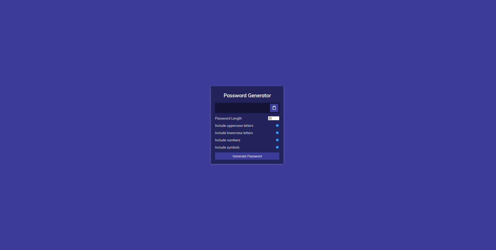

# Go Web Application After Devops Practices

### 🚀 DevOps Workflow Documentation

#### 1. 🐳 Dockerize the Go Application
- Containerize the Go application using Docker, creating a Dockerfile that includes all necessary dependencies and build instructions.

#### 2. ⚙️ Create Kubernetes Manifests
- Develop Kubernetes manifests to define the application's deployment, service, and other necessary resources in the Kubernetes cluster.

#### 3. 📦 Create Helm Charts
- Package the Kubernetes manifests into Helm charts for easier management and versioning. Ensure the charts are configurable using `values.yml`.

#### 4. 🌐 Configure Ingress Controller
- Set up and configure an Ingress Controller in the Kubernetes cluster to manage external access to the services.

#### 5. 🔄 Continuous Integration (CI) with GitHub Actions
- Implement a CI pipeline using GitHub Actions:
  - **🔨 Compile and Unit Test:** Automatically compile the Go application and run unit tests on each commit.
  - **🧐 Lint and Static Analysis:** Perform linting and static code analysis to maintain code quality.
  - **🐳 Dockerize and Push to Docker Hub:** Build the Docker image and push it to Docker Hub upon successful tests.
  - **🏷️ Update Helm Chart Tags:** Automatically update the tags in the `values.yml` of the Helm chart to match the latest Docker image.

#### 6. 🚀 Continuous Deployment (CD) with ArgoCD
- **📥 Deploy ArgoCD:** Install and configure ArgoCD in the Kubernetes cluster for continuous deployment.
- **⚡ Automate Deployment:**
  - Create a new ArgoCD application to monitor the `values.yml` file in the Helm chart repository.
  - Automatically deploy updates to the Kubernetes cluster when changes are detected in the Helm chart.

## Looks like this

